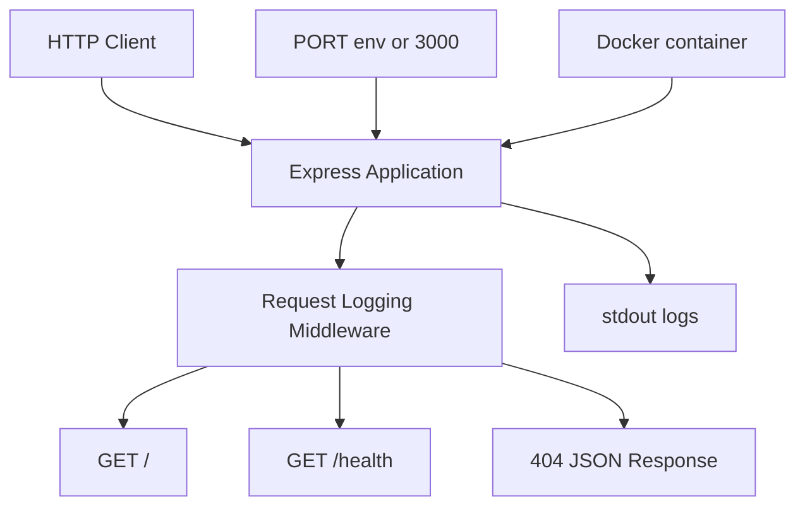

# Simple Web App Containerized with Docker


A minimal Node.js and Express service built for SRE practice, featuring Docker containerization, health checks, environment-based configuration, and stdout logging.

## Table of Contents

1. [Overview](#overview)
2. [Objectives](#objectives)
3. [Tech Stack](#tech-stack)
4. [Project Structure](#project-structure)
5. [Architecture](#architecture)
6. [Endpoints](#endpoints)
7. [Configuration](#configuration)
8. [Logging and Observability](#logging-and-observability)
9. [Running Locally](#running-locally)
10. [Running with Docker](#running-with-docker)
11. [Validation](#validation)
12. [Design Notes](#design-notes)
13. [Troubleshooting](#troubleshooting)
14. [Next Improvements](#next-improvements)

---

## Overview

This project implements a small HTTP service designed to demonstrate a clean operational baseline:

- a simple web application
- containerization with Docker
- configurable runtime via environment variables
- request and startup logging to stdout
- a basic health endpoint for service checks

The implementation is intentionally small and keeps the focus on runtime behavior rather than application complexity.

---

## Objectives

This exercise covers the following core concepts:

- exposing an HTTP service
- returning JSON responses
- using `PORT` for runtime configuration
- writing logs to standard output
- packaging the service in a Docker image
- validating service behavior both locally and in a container

---

## Tech Stack

| Tool | Purpose |
|---|---|
| `Node.js` | JavaScript runtime |
| `Express` | HTTP server framework |
| `npm` | Dependency management and scripts |
| `Docker` | Container build and execution |
| `PowerShell` | Local execution and manual testing |

### Repository Files

| File | Description |
|---|---|
| `index.js` | Application entry point |
| `package.json` | Project metadata, scripts, and dependencies |
| `package-lock.json` | Locked dependency tree |
| `Dockerfile` | Docker image definition |
| `.dockerignore` | Excludes unnecessary files from Docker build context |
| `.gitignore` | Excludes local artifacts from version control |
| `SPEC.md` | Project specification |
| `AGENTS.md` | Project conventions and working notes |
| `README.md` | Project documentation |

---

## Project Structure

```text
simple-web-app-containerized-with-docker/
|- .dockerignore
|- .gitignore
|- AGENTS.md
|- Dockerfile
|- README.md
|- SPEC.md
|- index.js
|- package-lock.json
`- package.json
```

---

## Architecture

The service uses a minimal single-process design.



### Runtime Flow

1. `node index.js` starts the application.
2. Express binds to `0.0.0.0`.
3. The server listens on `PORT` or defaults to `3000`.
4. Every incoming request is logged.
5. The defined routes return JSON responses.
6. Logs are visible locally and through `docker logs`.

---

## Endpoints

### `GET /`

Returns a simple status payload.

```json
{
  "status": "ok",
  "message": "simple web app running"
}
```

### `GET /health`

Returns a basic health response.

```json
{
  "status": "healthy"
}
```

### Undefined Routes

Any unspecified route returns `404` with a JSON response:

```json
{
  "status": "error",
  "message": "not found"
}
```

### Endpoint Summary

| Method | Route | Status | Description |
|---|---|---|---|
| `GET` | `/` | `200` | Basic service response |
| `GET` | `/health` | `200` | Health check endpoint |

---

## Configuration

### Environment Variables

| Variable | Description | Default |
|---|---|---|
| `PORT` | Listening port for the HTTP server | `3000` |

### Runtime Behavior

- If `PORT` is set, the server uses that value.
- If `PORT` is not set, the server listens on `3000`.
- The application binds to `0.0.0.0` for container compatibility.

---

## Logging and Observability

The service writes logs to standard output.

### Logged Events

- server startup
- HTTP method and path for each request
- ISO timestamp per request

### Example

```text
Server listening on 0.0.0.0:3000
2026-05-22T21:28:00.841Z GET /
2026-05-22T21:28:01.046Z GET /health
```

This is enough for basic runtime verification and container log inspection.

---

## Running Locally

### Prerequisites

- Node.js
- npm

### Install Dependencies

```powershell
npm install
```

### Start the Service

```powershell
npm start
```

### Start with a Custom Port

```powershell
$env:PORT=3001
npm start
```

### Test the Endpoints

```powershell
Invoke-RestMethod http://127.0.0.1:3000/
Invoke-RestMethod http://127.0.0.1:3000/health
```

### Alternative with `curl`

```bash
curl http://127.0.0.1:3000/
curl http://127.0.0.1:3000/health
```

---

## Running with Docker

### Build the Image

```powershell
docker build -t sre-simple-web-app .
```

### Run the Container

```powershell
docker run -p 3000:3000 sre-simple-web-app
```

### Run on a Different Host Port

```powershell
docker run -p 3001:3000 sre-simple-web-app
```

### Run with a Custom Application Port

```powershell
docker run -e PORT=3001 -p 3001:3001 sre-simple-web-app
```

### View Container Logs

```powershell
docker logs <container_id>
```

<details>
<summary>Dockerfile summary</summary>

The image:

- uses `node:20-alpine`
- sets `/app` as the working directory
- copies `package.json` and `package-lock.json`
- installs dependencies with `npm install --omit=dev`
- copies `index.js`
- exposes port `3000`
- defines a Docker `HEALTHCHECK` against `/health`
- starts the application with `node index.js`

</details>

---

## Validation

The project has been verified with the following checks:

### Local Checks

- [x] `npm install` completes successfully
- [x] `npm start` starts the service
- [x] `GET /` returns `200` with valid JSON
- [x] `GET /health` returns `200`
- [x] logs appear in the terminal
- [x] `PORT` changes the listening port

### Docker Checks

- [x] `docker build` completes successfully
- [x] `docker run` starts the container
- [x] the service is reachable through published ports
- [x] `docker logs` shows startup and request logs
- [x] the image defines a Docker `HEALTHCHECK` against `/health`

---

## Design Notes

| Decision | Rationale |
|---|---|
| Single `index.js` file | Keeps the service simple and easy to inspect |
| `Express` | Lightweight and sufficient for the exercise |
| Logs to `stdout` | Works naturally in containers and local execution |
| `0.0.0.0` binding | Required for external access in Docker |
| `PORT` via environment variable | Keeps configuration outside the source code |
| Docker `HEALTHCHECK` | Adds a basic runtime health signal at the container level |

---

## Troubleshooting

<details>
<summary>Port is already allocated</summary>

This usually means another local process or container is already using that host port.

Useful commands:

```powershell
docker ps
docker stop <container_id>
```

Or run the container on another host port:

```powershell
docker run -p 3001:3000 sre-simple-web-app
```

</details>

<details>
<summary>Docker build cannot connect to the daemon</summary>

Make sure Docker Desktop is running and the Docker engine is available before building or running containers.

</details>

<details>
<summary>Endpoints do not respond</summary>

Check that:

- the service is still running
- the correct port is being used
- there is no conflict with another local process

</details>

---

## Next Improvements

Potential next steps for extending this exercise:

- structured JSON logging
- automated tests
- a `/metrics` endpoint
- richer health checks
- a multi-stage Docker build
- CI pipeline integration

---

## Final Notes

This repository provides a compact but solid foundation for practicing service basics that are relevant to SRE work: runtime configuration, containerization, simple observability, and operational validation.
