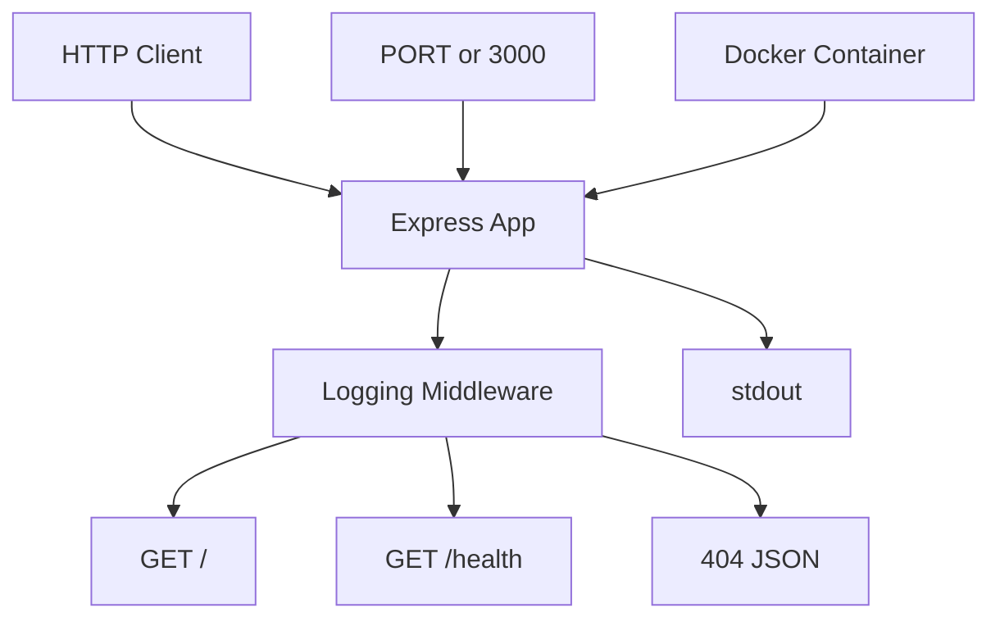

# Simple Web App Containerized with Docker


> Minimal SRE practice project to build, run, observe, and containerize a simple HTTP service with Node.js, Express, and Docker.

## Table of Contents

1. [Overview](#overview)
2. [Exercise Goal](#exercise-goal)
3. [Stack and Tools](#stack-and-tools)
4. [Development Approach](#development-approach)
5. [Project Structure](#project-structure)
6. [Architecture and Flow](#architecture-and-flow)
7. [Endpoints](#endpoints)
8. [Configuration](#configuration)
9. [Observability](#observability)
10. [Local Installation and Run](#local-installation-and-run)
11. [Docker Usage](#docker-usage)
12. [Validation Checklist](#validation-checklist)
13. [Technical Decisions](#technical-decisions)
14. [Troubleshooting](#troubleshooting)
15. [Using This Project with Codex](#using-this-project-with-codex)
16. [Future Improvements](#future-improvements)

---

## Overview

This project implements a minimal web application focused on operational clarity.

The app:

- exposes an HTTP server
- returns JSON from `/`
- exposes a health check at `/health`
- uses `PORT` as an environment variable
- writes logs to `stdout`
- can run inside Docker

### Expected Outcomes

| Capability | Expected Result |
|---|---|
| HTTP service | Responds correctly |
| Configuration | Uses `PORT` or defaults to `3000` |
| Observability | Logs are visible in console and through `docker logs` |
| Containerization | The app can be built and run with Docker |

---

## Exercise Goal

The goal of this exercise is to demonstrate real service operation fundamentals:

- building a simple application
- exposing a network port
- configuring runtime through environment variables
- implementing basic logging
- packaging the service in a reproducible container

> The focus is not feature complexity. The focus is operational clarity.

---

## Stack and Tools

| Tool | Role in the project |
|---|---|
| `Node.js` | Runtime used to execute the application |
| `Express` | Minimal HTTP framework |
| `npm` | Dependency installation and project scripts |
| `Docker` | Container build and execution |
| `Docker Desktop` | Local Docker engine on Windows |
| `PowerShell` | Local commands, testing, and environment variables |
| `docker logs` | Container log inspection |

### Documentation Files

| File | Purpose |
|---|---|
| `SPEC.md` | Defines what to build |
| `AGENTS.md` | Defines how the agent should work |
| `README.md` | Explains how to understand, run, and validate the project |

---

## Development Approach

This project follows `spec-driven development`.

That means:

1. Define the system contract first.
2. Implement the code second.
3. Validate the implementation against explicit criteria.

### Core Principles Used

- reduce ambiguity before coding
- turn requirements into testable contracts
- separate `what to build` from `how to build it`
- avoid over-engineering in small exercises

<details>
<summary>Why this helps when working with agents</summary>

Agents produce more reliable results when project context is explicit.

- `SPEC.md` reduces functional improvisation
- `AGENTS.md` reduces technical improvisation
- `README.md` improves operational understanding and context transfer

</details>

---

## Project Structure

```text
simple-web-app-containerized-with-docker/
|- .dockerignore
|- AGENTS.md
|- Dockerfile
|- README.md
|- SPEC.md
|- index.js
|- package-lock.json
`- package.json
```

### Quick Description

| Path | Description |
|---|---|
| `index.js` | Express server and endpoints |
| `package.json` | Dependencies and `start` script |
| `package-lock.json` | Locked dependency versions |
| `Dockerfile` | Container image definition |
| `.dockerignore` | Files excluded from Docker build context |
| `SPEC.md` | Functional and operational specification |
| `AGENTS.md` | Implementation rules for the agent |
| `README.md` | Full project documentation |

---

## Architecture and Flow

The architecture is intentionally flat and minimal.



### Runtime Flow

1. `Node.js` runs `index.js`.
2. `Express` creates the HTTP server.
3. The service listens on `0.0.0.0`.
4. The port comes from `PORT` or defaults to `3000`.
5. Every request passes through the logging middleware.
6. Endpoints return JSON responses.
7. Logs remain available in the console and in Docker.

---

## Endpoints

### `GET /`

Confirms that the service is running.

**Expected response**

```json
{
  "status": "ok",
  "message": "simple web app running"
}
```

### `GET /health`

Provides a minimal health response suitable for basic operational checks.

**Expected response**

```json
{
  "status": "healthy"
}
```

### Undefined Routes

Return `404` in JSON:

```json
{
  "status": "error",
  "message": "not found"
}
```

### Endpoint Summary

| Method | Route | Status | Purpose |
|---|---|---|---|
| `GET` | `/` | `200` | Confirm the service is running |
| `GET` | `/health` | `200` | Basic health check |

---

## Configuration

### Environment Variables

| Variable | Description | Default Value |
|---|---|---|
| `PORT` | Port used by the HTTP server | `3000` |

### Runtime Rules

- if `PORT` exists, the app uses that value
- if `PORT` does not exist, the app uses `3000`
- the service binds to `0.0.0.0`

---

## Observability

The observability implemented here is basic, but appropriate for the exercise.

### What Gets Logged

- server startup
- HTTP method for every request
- requested path
- ISO timestamp per request

### Example Logs

```text
Server listening on 0.0.0.0:3000
2026-05-22T21:28:00.841Z GET /
2026-05-22T21:28:01.046Z GET /health
```

### Why This Matters in SRE

- confirms the process started correctly
- confirms the service is receiving traffic
- supports basic debugging
- works directly with `docker logs`

---

## Local Installation and Run

### Prerequisites

- `Node.js`
- `npm`
- `Docker Desktop` if you want to validate the container

### Install Dependencies

```powershell
npm install
```

### Run Locally

```powershell
npm start
```

### Run with a Custom Port

```powershell
$env:PORT=3001
npm start
```

### Test Endpoints with PowerShell

```powershell
Invoke-RestMethod http://127.0.0.1:3000/
Invoke-RestMethod http://127.0.0.1:3000/health
```

### Alternative with `curl`

```bash
curl http://127.0.0.1:3000/
curl http://127.0.0.1:3000/health
```

---

## Docker Usage

### Build the Image

```powershell
docker build -t sre-simple-web-app .
```

### Run the Container

```powershell
docker run -p 3000:3000 sre-simple-web-app
```

### Run with a Custom Port

```powershell
docker run -e PORT=3001 -p 3001:3001 sre-simple-web-app
```

### View Container Logs

```powershell
docker logs <container_id>
```

<details>
<summary>What the Dockerfile does</summary>

The `Dockerfile`:

- uses `node:20-alpine`
- sets `/app` as the working directory
- copies `package.json` and `package-lock.json`
- installs dependencies with `npm install --omit=dev`
- copies `index.js`
- exposes `3000`
- starts the app with `node index.js`

</details>

---

## Validation Checklist

### Functional Checklist

- [x] The server starts correctly
- [x] `GET /` returns `200` with valid JSON
- [x] `GET /health` returns `200`
- [x] Logs appear in stdout
- [x] `PORT` changes the actual listening port

### Container Checklist

- [ ] `docker build` completes successfully
- [ ] `docker run -p 3000:3000` exposes the service
- [ ] `docker logs` shows process logs

> Docker validation depends on Docker Desktop being started and the daemon being available.

---

## Technical Decisions

| Decision | Reason |
|---|---|
| `Express` | Simple and sufficient for a minimal service |
| Single `index.js` file | Avoids unnecessary layers |
| Logs to `stdout` | Works naturally with containers and basic observability |
| `0.0.0.0` binding | Required for external access from the container |
| `PORT` via environment | Keeps configuration outside the code |

---

## Troubleshooting

<details>
<summary>`docker build` cannot connect to Docker</summary>

Possible causes:

- Docker Desktop is not running
- the Docker daemon is not available

What to check:

- open Docker Desktop
- wait until the Linux engine is active
- retry `docker build`

</details>

<details>
<summary>The port is already in use</summary>

Symptoms:

- the app does not start
- the bind operation fails

Solution:

- use a different `PORT`
- stop the process using that port

</details>

<details>
<summary>The endpoints do not respond</summary>

What to check:

- make sure the process is still running
- confirm you are using the correct port
- verify there is no local conflict or firewall issue

</details>

---

## Using This Project with Codex

### Recommended Prompt

```text
Implement this project following SPEC.md and AGENTS.md. Start with a minimal Node.js Express server.
```

### Role of Each Document

| File | Role |
|---|---|
| `SPEC.md` | Functional and operational contract |
| `AGENTS.md` | Implementation rules and constraints |
| `README.md` | Operational context and usage guide |

---

## Future Improvements

If you want to evolve the project after the exercise, these improvements would make sense:

- structured JSON logs
- a `/metrics` endpoint
- automated tests
- richer health checks
- a multi-stage `Dockerfile`
- a basic CI pipeline

---

## Final Summary

This project is a small but correct base for practicing:

- minimal service design
- environment-based configuration
- basic observability
- containerization
- specification-driven implementation

> This is exactly the kind of exercise that helps build operational judgment without unnecessary complexity.
